## 3. События

**1. В лотерее на карточке, содержащей 49 чисел, нужно отметить 6 чисел.
Затем эти числа сверяются с 6 числами, отобранными случайным образом.
Каковы вероятности угадать n чисел, n = 1, 2, 3, 4, 5, 6?**  

_Сколько вообще существует наборов по 6 различных карт:_
  

  

_Поймем, что случай, когда совпали все 6 карт - всего 1_  

_При этом также у нас есть различные варианты того, какие конкретно числа совпали:_

_Когда совпали 5 карт - мы выбираем одну карту из оставшихся 43 (5 уже выбрали, а 6я не должна совпасть):_   

_Для n = 4:_

_Для n = 3:_

_Для n = 2:_

_Для n = 1:_

_Соответственно вероятности - это_

_Для n = 6:_

_Для n = 5:_

_Для n = 4:_

_Для n = 3:_

_Для n = 2:_

_Для n = 1:_

_Ну или в общем виде:
если A - общее количество чисел (49)
B - количество чисел, которое выбираем (6)
n - количество совпадающих чисел (1-6)_

**2. На каждой грани правильного додекаэдра написаны числа от 1 до 12
(игральный додекаэдр). Бросаются 3 додекаэдра на плоскость и считается
сумма значений на гранях, лежащих на плоскости. Выписать 5 самых
вероятных сумм и их вероятности.**  
   [код](2.py)  
   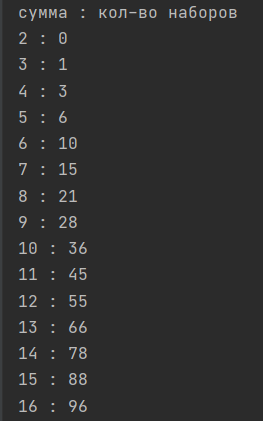 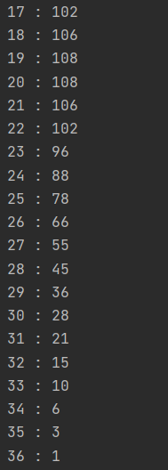  
   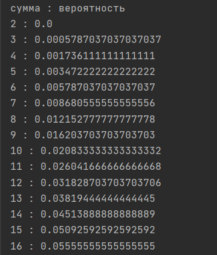 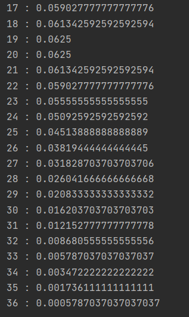
   
**3. На грани правильного додекаэдра написали первые буквы названий
месяцев. Сколько раз нужно бросить додекаэдр, чтобы с вероятностью
0,99 выпала хотя бы 1 раз буква А?**  
   [код](3.py)  
 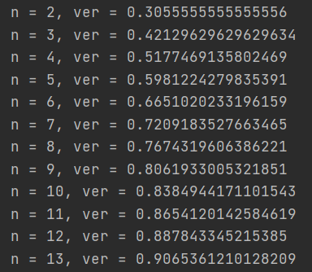 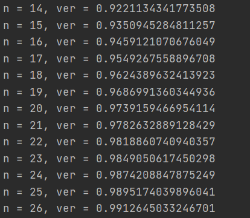 
  
**4. В списке фамилий студентов вашей группы опечатка в одной букве. Найти
вероятность, что неверно написана гласная буква.**  
   [код](4.py)  
 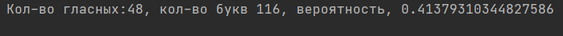
  

**5. Предположим, что все забыли свои дни рождения. Найти вероятность
того, что дни рождения 12 человек придутся на разные месяцы?**  
   [код](5.py)  
 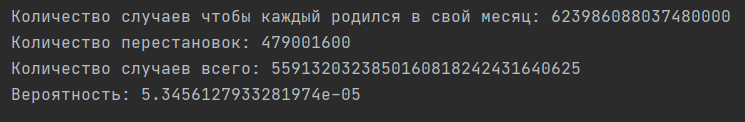
  
  
**6. В таблице выписаны простые числа от 1 до 1000. Событие A — сумма
цифр простого числа кратна 5. Событие B — простое число начинается с 1.
Событие C — простое число двухзначное. Найти вероятность события (A∆C) \ B.**  
   [код](6.py)  
   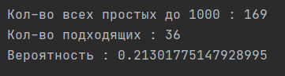
  
**7. На шахматную доску ставят наудачу k ладей. С какой вероятностью они
не будут бить друг друга?**  
   [код](7.py)  
   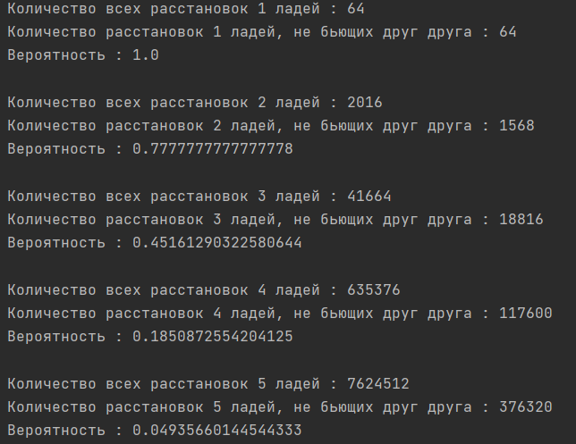  
   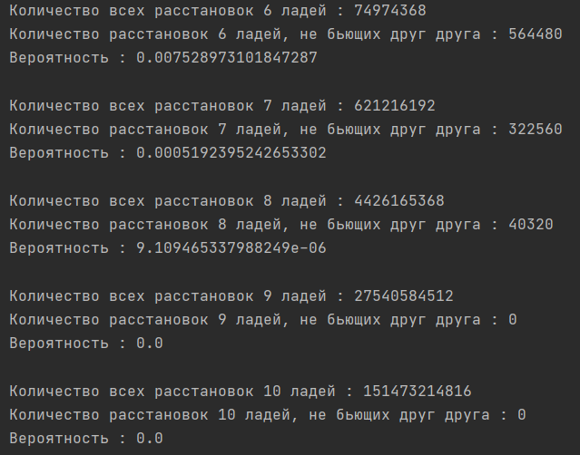
