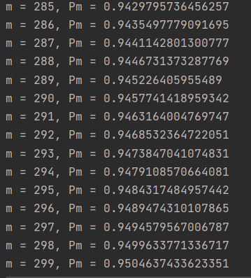
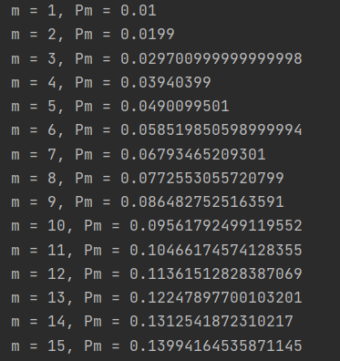

**1. Вы встретились с шахматистом равной с Вами силы (ничейные
результаты исключены). Что более вероятно: выиграть более одного раза
в 4 партиях или более двух раз в 6 партиях?**  
  
_Воспользуемся формулой для подсчета вероятности в схеме испытаний Бернулли_  
__

_**Для 4 партий:**_
_Вероятность выиграть 0 раз_  
__
  
  
  
_Вероятность выиграть 1 раз_  
__
  
_Тогда вероятность выиграть больше одного раза_
__  
  

_**Для 6 партий:**_  
  
  
_Вероятность выиграть 0 раз_  
__
  

_Вероятность выиграть 1 раз_  
__
   
  
_Вероятность выиграть 2 раза_  
__
  

_Тогда вероятность выиграть больше двух раз_

_

  
**2. В кошельке лежат 8 монет достоинством 5 копеек и 2 монеты
достоинством 3 копейки. Наудачу выбирается монета и бросается 5 раз.
Какова вероятность того, что в сумме будет 15 очков, если герб
принимается за 0 очков?**  
  
_Воспользуемся формулой для подсчета вероятности в схеме испытаний Бернулли_  
__  

_Посчитаем верояность получить 15 очков, если выбрали 3 копейки_  
__
  
  
_Посчитаем верояность получить 15 очков, если выбрали 5 копеек_  
__
    

_А теперь вспомним, что монеты в 3 и в 5 копеек выпадают с разной вероятностью. Посчитаем полную:_
__

  
  
**3. Два баскетболиста делают по три броска в корзину. Вероятность
попадания у первого 0.6, у второго 0.7. Найти вероятность того, что у
обоих будет равное количество попаданий.**  
  
_Воспользуемся формулой для подсчета вероятности в схеме испытаний Бернулли_  
__  
  
_Вероятность того, что первый забьет 0 раз_  
__
_Вероятность того, что первый забьет 0 раз_  
__ 
  
  
_Соответственно вероятность того, что оба ни разу не забьют_  
__
  

_Вероятность того, что первый забьет 1 раз_  
  
__
  
_Вероятность того, что первый забьет 1 раз_  
__
  
_Соответственно вероятность того, что оба забьют по 1 разу_  
__  
  
  

_Вероятность того, что первый забьет 2 раза_  
  
__
  
_Вероятность того, что первый забьет 2 раза_  
 
__
  
_Соответственно вероятность того, что оба забьют по 2 раза_  
  
__  
  

_Вероятность того, что первый забьет 3 раза_  
__
_Вероятность того, что первый забьет 3 раза_  
__
_Соответственно вероятность того, что оба забьют по 3 раза_  
__  
  
  
  
_Итоговая вероятность_
__
  
  
**4. Партия изделий содержит 1% брака. Каков должен быть объем
контрольной выборки, чтобы вероятность обнаружить в ней хотя бы одно
бракованное изедлие была не меньше 0.95?**  
  
_Воспользуемся формулой для подсчета вероятности в схеме испытаний Бернулли_  
__  
  
  
_Эта вероятность должна быть не меньше 0.95. То есть мы ищем m при котором_  
__   
  
[код с перебором](4.py)

