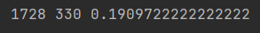
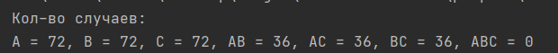

1. В ящике m белых шаров и n черных. Из ящика выбирают наугад k шаров
без возвращения. Какова вероятность, что все k шаров белые?    
     

     
_Всего различных вариантов набрать k шаров -_ 

_Всего различных вариантов набрать k белых шаров -_ 

_Вероятность соответственно:_

2. Бросают 3 игральных додекаэдра. Какова вероятность, что на одном из
них выпадет 12, если известно, что все выпавшие значения разные?
     

_Количество случаев, что на одном выпадет 12, а на других — различные числа, отличные от 12 -_
  
_И это все нужно умножить на три, поскольку 12 могло выпадать на каждом из 3х додекаэдоров:_

Количество всех вариантов выпадения:

Итого вероятность:

Проверим кодом:
[код](2.py)
  

   

3. Бросают 2 игральных додекаэдра. Определим три события:  
   - A — на первом додекаэдре выпало нечетное число,   
   - B — на втором додекаэдре выпало нечетное число,   
   - C — сумма на двух додекаэдрах нечетная.   
     Являются ли эти события в совокупности/попарно независимыми?

_*Являются ли события попарно независимыми*_
_События попарно независимы:_
=P(B)<=>P(A\cdot&space;B)=P(A)\cdot&space;P(B)<=>P(B|A)=P(A))

_События независимы в совокупности:_
=P(A)\cdot&space;P(B)\cdot&space;P(C))

Количество случаев:  

[код для рассчета случаев](3.py)

=P(B)=P(C)=\frac{72}{144}=\frac{1}{2})  
=P(A\cdot&space;C)=P(B\cdot&space;C)=\frac{36}{144}=\frac{1}{4})  
=0/144&space;)

_Соответственно условия попарной независимости выполнены_  
_А условия независимости в совокупности - нет_
  
4. Из колоды из 52 карт вынули 1 карту. Независимы ли события A —
вынутая карта червовая, B — вынутая карта туз? Аналогичный вопрос
для колоды из 54 карт с добавленными джокерами?
   
_*Для колоды без джокеров*_  
=\frac{13}{52}=\frac{1}{4})  
=\frac{4}{52}=\frac{1}{13})  
=\frac{1}{52})
  
_Условие независимости выполнено_
  
_*Для колоды с джокерами*_  
=\frac{13}{54})  
=\frac{4}{54})  
=\frac{1}{54})  
  
_Условие независимости не выполнено_
       

5. Из колоды 36 карт последовательно вынимают 3 карты. Какова
вероятность вытащить туз, король, даму (в такой последовательности)?
  
_Вытащить в первый раз туз - вероятность:_  

  
  
_Вероятность вытащить во второй раз короля, когда в первый раз был не король:_  

  

_Вероятность вытащить третьим ходом даму, когда и в первый и во второй была не дама:_  

  
  
_Итого общая вероятность:_

  

  
  
6. Два стрелка поочередно стреляют по мишени до первого попадания
каждым стрелком. При каждом выстреле вероятность попадания для
первого стрелка равна 0.2, для второго стрелка равна 0.3. Найти
вероятность того, что первый стрелок сделает больше выстрелов, чем
второй. 
_"до первого попадания каждым стрелком" - означает, что оба прекращают стрелять как только и у первого и у второго будут попадания_
  
  
_"вероятность того, что первый стрелок сделает больше выстрелов" - то есть по сути первый сделает больше выстрелов когда он будет стрелять последним - то есть, когда он попадет позже чем второй_

_Соответственно, нам нужно посчитать вероятность того, что второй стрелок попадет раньше_  

_Пусть второй стрелок попадает ПЕРВЫМ со СВОЕГО первого выстрела_  
  
_Вероятность этого события:_

\cdot&space;0,3)  

_Пусть второй стрелок попадает ПЕРВЫМ со СВОЕГО второго выстрела_  
  
_Вероятность этого события:_

^2\cdot&space;(1-0,3)\cdot&space;0,3)

_Пусть второй стрелок попадает ПЕРВЫМ со СВОЕГО третьего выстрела_  
  
_Вероятность этого события:_

^3\cdot&space;(1-0,3)^{2}\cdot&space;0,3)
  
  
_В общем виде для попадания 2-го стрелка с n-того выстрела_  
^{n})\cdot&space;(0,7)^{n-1}\cdot&space;0,3=0,14^{n}\cdot&space;\frac{0,3}{0,7})

     

7. Партия из 100 деталей подвергается выборочному контролю. Условием
непригодности всей партии является наличие хотя бы одной бракованной
детали среди пяти проверяемых. Какова вероятность для данной партии
быть непринятой, если она содержит 5% бракованных деталей?  
[код](7.py)
     
  
8. Вероятность хотя бы одного попадания в мишень при трех выстрелах
равна 0.875. Найти вероятность попадания при одном выстреле.  
[код](8.py)
     

9. Для того, чтобы разрушить мост, нужно попадание не менее а) одной б)
двух бомб. Независимо сбросили три бомбы с вероятностью попадания 0.1,
0.3, 0.4. Какова вероятность, что мост разрушен?
[код](9.py)
